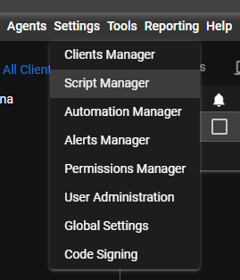

# Documentación para Configurar un Servidor RustDesk y Crear Scripts de PowerShell en Tactical RMM

## Índice
1. [Instalar el Servidor RustDesk](#instalar-el-servidor-rustdesk)
2. [Abrir Puertos](#abrir-puertos)
3. [Crear Scripts de PowerShell](#crear-scripts-de-powershell)
4. [Crear una Acción de URL](#crear-una-acción-de-url)
5. [Crear Campos Personalizados](#crear-campos-personalizados)
6. [Crear Tareas de Recolector y Verificaciones de Script](#crear-tareas-de-recolector-y-verificaciones-de-script)

## Instalar el Servidor RustDesk

Para instalar tu propio servidor RustDesk, sigue la [documentación oficial de RustDesk](https://rustdesk.com/docs/) o consulta nuestra [documentación específica del Servidor RustDesk](). 

## Abrir Puertos

Asegúrate de que en el router estén abiertos los siguientes puertos:

- **21115:** Relay
- **21116:** Rendezvous

Si necesitas más información sobre cómo abrir puertos, puedes consultar esta [guía sobre DCHP_server](https://github.com/ganaloterias/docs/blob/main/DCHP_server/README.md).

## Crear Scripts de PowerShell

Para crear scripts de PowerShell en Tactical RMM, sigue estos pasos:

1. Inicia sesión en Tactical RMM.
2. Dirígete a `Settings > Script Manager`. 
3. Haz clic en `NEW` para crear un nuevo script.
4. Ingresa los scripts necesarios desde la carpeta correspondiente. 
   
**Nota Importante:** 
- Asegúrate de cambiar los valores de `rendezvous_server`, `relay_server`, `api_server`, y `key` con los datos de tu servidor RustDesk.
- No uses la opción `run user only` al ejecutar los scripts, ya que esto puede causar problemas en su ejecución.



## Crear una Acción de URL

Para crear una acción de URL en Tactical RMM, sigue estos pasos:

1. Ve a `Global Settings`.
2. Navega a la sección de `URL Actions`.
3. Crea una nueva acción e ingresa la URL con el siguiente formato:
   ```plaintext
   rustdesk://connection/new/{{agent.rustdeskid}}?password={{agent.rustdeskpwd}}```


## Crear Campos Personalizados
Para almacenar el ID y la contraseña de RustDesk, sigue estos pasos:

   1. Ve a Global Settings.
   2. Navega a la sección de CustomFields.
   3. Crea dos nuevos campos: rustdeskid y rustdeskpwd.

## Crear Tareas de Recolector y Verificaciones de Script
 Tareas de Recolector
   1. Dirígete a cualquier agente y navega a la pestaña tasks.
   2. Haz clic en add task.
   3. Asigna un nombre a la tarea y marca la casilla collector task.
   4. Selecciona el campo personalizado correspondiente (por ejemplo, rustdeskid).
   5. Selecciona el script adecuado del menú desplegable (por ejemplo, ID RustDesk).
   6. Configura la frecuencia de ejecución automática del script según tus necesidades.
   7. Guarda la tarea.

## Verificaciones de Script
   1. Dirígete a la pestaña checks en el menú inferior.
   2. Haz clic en new y selecciona script check.
   3. Selecciona el script correspondiente y haz clic en Save.
Después de seguir estos pasos, podrás realizar pruebas de conexión de RustDesk con otros equipos que estén agregados en Tactical RMM.

Nota Importante:
El equipo en el que ejecutes estos comandos debe tener el agente de Tactical instalado; de lo contrario, no aparecerá en el panel.
Para ejecutar un script, haz clic derecho en el equipo y selecciona Run Script.
